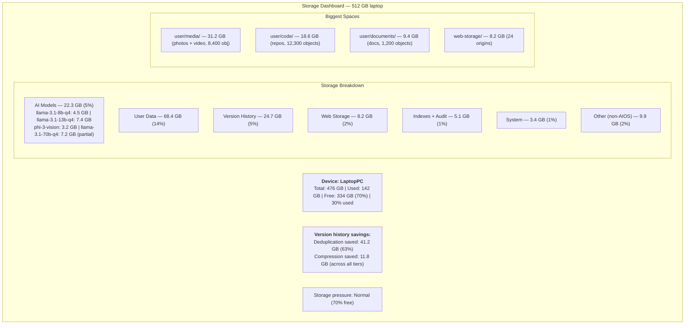

# AIOS Space Storage — Storage Budget and Pressure Management

Part of: [spaces.md](../spaces.md) — Space Storage System
**Related:** [block-engine.md](./block-engine.md) — Block Engine (zone allocation, compression), [versioning.md](./versioning.md) — Version Store (retention policies)

-----

## 10. Storage Budget and Pressure Management

### 10.1 Device Profiles

AIOS initially targets **laptops and PCs** but is architectured for multi-device support. The storage system uses device profiles to adapt quotas, pressure thresholds, and model caching strategies to each class of hardware. Only the Laptop/PC profile is active at launch; others are defined here for architectural foresight and will be activated when hardware support is added.

```rust
pub enum DeviceProfile {
    /// Initial target. 256 GB - 2 TB SSD. 8-64 GB RAM.
    /// Comfortable storage — multiple models, generous version history.
    LaptopPC,

    /// Future. 256 GB - 1 TB. 6-8 GB RAM.
    /// Storage similar to laptops but RAM is much tighter.
    /// Models compete with apps for limited RAM.
    Tablet,

    /// Future. 128 GB - 1 TB. 6-8 GB RAM.
    /// Apps and media consume 50-70% of storage.
    /// AIOS competes for the remaining 30-50%.
    Phone,

    /// Future. 16 GB - 128 GB. Limited RAM.
    /// Streaming-first: models streamed from network or hub device.
    /// Minimal local storage for config + cache.
    TV,

    /// Future. 32 GB - 256 GB SD/eMMC. 2-8 GB RAM.
    /// Tight on everything. Single model, aggressive eviction.
    SingleBoardComputer,
}

impl DeviceProfile {
    pub fn detect() -> Self {
        // At launch: always returns LaptopPC
        // Future: detect from hardware inventory (storage size, RAM, device tree)
        DeviceProfile::LaptopPC
    }
}
```

**Why device profiles matter for storage:**

| Device | Typical Storage | Apps/Media Pressure | AIOS Available | Model Strategy |
|---|---|---|---|---|
| **Laptop/PC** | 256 GB - 2 TB | Low (20-30%) | 180-1400 GB | Multiple models on disk |
| Tablet (future) | 256 GB - 1 TB | Medium (40-50%) | 130-500 GB | 2-3 models on disk |
| Phone (future) | 256 GB - 1 TB | **High (50-70%)** | 75-300 GB | 1-2 models on disk |
| TV (future) | 16-128 GB | Medium (apps) | 8-60 GB | Stream from network |
| SBC (future) | 32-256 GB | Low | 28-230 GB | Single model, aggressive eviction |

Phones are the tightest — 256 GB minimum these days, but apps and games consume 50-70% of that. On a 256 GB phone with 60% used by apps/media, AIOS gets ~100 GB. That's still workable but requires careful budgeting. This constraint doesn't apply to the initial laptop/PC target where storage pressure from other apps is much lower.

### 10.2 Storage Budget — Laptop/PC (Initial Target)

On laptops and PCs, storage is relatively generous. A typical laptop has 256 GB - 1 TB, and user apps/data (outside AIOS) rarely consume more than 20-30%. The storage budget reflects this:

```text
Storage budget for laptops/PCs (estimated, after OS partition overhead):

                        256 GB SSD    512 GB SSD    1 TB SSD      2 TB SSD
                        ──────────    ──────────    ────────      ────────
Usable after format:    ~238 GB       ~476 GB       ~931 GB       ~1863 GB

AI models:               15-30 GB      30-60 GB      50-100 GB     100-200 GB
  (3-6 models)          (mix of 8B,   (8B + 13B +   (full model    (full library
                         13B, vision)  70B Q4)        library)      + large models)

OS + system spaces:      3-4 GB        3-4 GB        4-5 GB        4-5 GB
  (kernel, agents,
   credentials, config)

Indexes + audit:         2-5 GB        4-10 GB       8-20 GB       15-40 GB
  (FTI, HNSW, audit
   Merkle chain)

Version history:         10-25 GB      20-50 GB      40-80 GB      50-100 GB
  (generous retention;
   KeepLast(50) laptop override; base default KeepLast(20))

User data:               80-150 GB     200-300 GB    400-600 GB    800-1200 GB
  (documents, media,
   conversations, code)

Web storage:             3-10 GB       5-15 GB       10-25 GB      15-40 GB
  (per-origin storage,
   browser cache)

Free headroom:           35-70 GB      70-140 GB     140-280 GB    280-560 GB
  (target: ≥15% free)
```

**Key differences from constrained devices:**
- **Multiple models fit comfortably.** A 256 GB laptop can hold 3-6 models (15-30 GB) without meaningful pressure. A 1 TB laptop can store every model a user might want.
- **Generous version history.** Default retention is overridden to `KeepLast(50)` instead of the base `KeepLast(20)` (see §10.7 for full retention policy). On 512 GB+, `KeepAll` is viable for spaces the user cares about.
- **Full embedding index.** Enough space and RAM to maintain embeddings for all promoted objects, not just a subset.
- **70B models become feasible.** A Q4-quantized 70B model is ~40 GB. On a 512 GB laptop with 64 GB RAM, this is the first device class where it's practical to store and run.

### 10.3 Storage Budget — Future Device Classes

> **Implementation status:** Phase 21+. These budgets are for architectural planning. Phase 4 targets LaptopPC only. Phone, TV, and SBC profiles will be activated when hardware support is added.

These budgets are not active yet. They exist for architectural planning so the storage system doesn't make assumptions that only work on laptops.

```text
Phone (future, 256 GB with 60% apps/media):
  AIOS available:      ~100 GB
  AI models:            8-15 GB   (1-2 models, prefer smaller quantizations)
  OS + system:          2-3 GB
  Indexes + audit:      1-3 GB
  Version history:      5-15 GB   (KeepLast(20) default)
  User data:            40-60 GB
  Web storage:          2-5 GB
  Free headroom:        15-25 GB

TV (future, 32 GB):
  AIOS available:       ~20 GB
  AI models:            0-2 GB    (stream from network or hub device;
                                   cache small model for offline)
  OS + system:          2 GB
  Indexes + audit:      0.5 GB
  Version history:      1-3 GB    (KeepLast(5) default)
  User data:            5-10 GB   (preferences, watchlists, conversation history)
  Web storage:          1-2 GB
  Free headroom:        3-5 GB

SBC (future, 64 GB):
  AIOS available:       ~55 GB
  AI models:            4.5-8 GB  (1-2 small models)
  OS + system:          2 GB
  Indexes + audit:      1-2 GB
  Version history:      3-8 GB    (KeepLast(10) default)
  User data:            15-25 GB
  Web storage:          1-3 GB
  Free headroom:        8-15 GB
```

### 10.4 Storage Quotas by Category

Each storage category has a quota to prevent any single concern from consuming the device. Quotas are parameterized by device profile:

```rust
pub struct StorageBudget {
    total_usable: u64,
    profile: DeviceProfile,
    quotas: StorageQuotas,
}

pub struct StorageQuotas {
    /// AI model storage — GGUF files on disk
    /// LaptopPC default: 20% of usable space
    /// Phone default: 15%
    /// TV default: 10% (streaming preferred)
    models: StorageQuota,

    /// System spaces (OS, agents, credentials, config)
    /// Default: 5% of usable space, minimum 2 GB
    system: StorageQuota,

    /// Indexes and audit (FTI, HNSW, Merkle chain)
    /// Default: 5% of usable space, minimum 1 GB
    indexes_audit: StorageQuota,

    /// Version history (Merkle DAG, old content blocks)
    /// LaptopPC default: 15% of usable space
    /// Phone default: 10%
    /// TV default: 5%
    versions: StorageQuota,

    /// User data (personal spaces — documents, media, conversations)
    /// Default: no hard limit — gets whatever is left
    user_data: StorageQuota,

    /// Web storage (per-origin: cookies, localStorage, IndexedDB, cache)
    /// Default: 5% of usable space, max 5 GB per origin
    web_storage: StorageQuota,

    /// Minimum free headroom — triggers pressure response when breached
    /// Default: 20% of usable space (matches StoragePressure::Normal threshold)
    free_headroom_target: f64,
}

pub struct StorageQuota {
    /// Percentage of total usable space
    percentage: f64,
    /// Absolute minimum (never go below this)
    minimum: Option<u64>,
    /// Absolute maximum (never exceed this)
    maximum: Option<u64>,
    /// Current usage
    used: u64,
}
```

**User data has no hard cap.** The user's own files are the reason the device exists. Every other category has a ceiling; user data gets whatever isn't claimed by quotas and headroom. If a user fills their device with photos and documents, that's their choice — the system adapts by tightening version retention and deferring index work.

### 10.5 Storage Pressure Response

Like memory pressure (see [memory.md §8](../../kernel/memory.md)), storage has pressure levels with escalating responses:

```rust
/// Analogous to MemoryPressure in memory.md — same thresholds, but worst
/// level is Emergency (not Oom), since storage exhaustion is recoverable.
pub enum StoragePressure {
    /// > 20% free — normal operation
    Normal,
    /// 10-20% free — start reclaiming
    Low,
    /// 5-10% free — aggressive reclamation
    Critical,
    /// < 5% free — emergency mode
    Emergency,
}

/// Events emitted by the storage budget system. Visible in the Inspector
/// and delivered to subscribed agents via IPC notification.
pub enum StorageEvent {
    PressureChanged {
        from: StoragePressure,
        to: StoragePressure,
    },
    VersionRetentionReduced {
        space: SpaceId,
        old_depth: u32,
        new_depth: u32,
    },
    QuotaExceeded {
        category: StorageCategory,
        used: u64,
        limit: u64,
    },
    ModelEvicted {
        model_id: ModelId,
        freed_bytes: u64,
    },
}

pub enum StorageCategory {
    Models,
    System,
    IndexesAudit,
    Versions,
    UserData,
    WebStorage,
}
```

```text
Pressure response table:

Level       Free %    Actions
──────────  ──────    ──────────────────────────────────────────────────────
Normal      > 20%     Normal operation. GC runs on schedule.
                      Version retention per space quota.

Low         10-20%    - Tighten retention: KeepAll → KeepLast(10); KeepLast(n) → KeepLast(min(n, 5))
                      - Run GC immediately (don't wait for threshold)
                      - Evict embedding index entries for cold objects
                        (regenerated on demand)
                      - Compress warm blocks → cold (zstd level 9)
                      - Notify user: "Storage getting low. [X] GB free."

Critical    5-10%     - Tighten version retention: KeepLast(5) → KeepLast(2)
                      - Purge web-storage caches (Cache API, not localStorage)
                      - Compact audit logs (force summary tier for >3 days)
                      - Evict all non-primary model files from disk
                        (re-download on demand)
                      - Pause Space Indexer (no new embeddings)
                      - Notify user: "Storage critically low. Free up space
                        or data may be affected."

Emergency   < 5%      - Version retention: KeepLast(1) (current version only)
                      - Purge ALL web-storage except localStorage
                      - Delete all non-primary model files
                      - Halt all background writes (indexing, audit flush)
                      - Block new object creation from background agents
                      - Interactive writes still allowed (user comes first)
                      - Notify user: "Storage full. Only essential operations
                        are possible. Please free space immediately."
```

**Reclamation coordination:** When pressure triggers reclamation, actions execute in priority order: (1) tier demotion — recompress warm blocks to cold (zstd level 9), often freeing 20-40% of block storage with no data loss; (2) version retention pruning — reduce history depth per the table above; (3) embedding index eviction — remove HNSW entries for cold objects (regenerated on demand); (4) web storage purge — delete Cache API and browser caches; (5) model eviction — delete re-downloadable model files. Blocks marked for tier demotion are never deleted before recompression completes. Blocks are released only after all versions referencing them are pruned.

**Quota enforcement:** Quotas use soft limits by default — pressure response triggers at threshold, but writes succeed. Hard limits apply to web storage (5 GB per origin) and model storage (configurable). User data has no hard limit — it gets whatever is left after other categories. When a hard limit is breached, writes fail with `ENOSPC`. When a soft limit is breached, the pressure response escalates but writes continue.

### 10.6 Model Storage Strategy

AI model files are the single largest storage consumer and unlike user data, they are **reproducible** — a deleted model can be re-downloaded. This makes them the best target for reclamation under storage pressure.

```rust
pub struct ModelStoragePolicy {
    /// Maximum disk space for all model files combined
    max_disk: u64,                      // from StorageQuotas.models
    /// Models currently on disk
    on_disk: Vec<ModelDiskEntry>,
    /// Device profile determines eviction behavior
    profile: DeviceProfile,
    /// The primary model (never evicted)
    primary_model: ModelId,
}

impl ModelStoragePolicy {
    fn is_primary(&self, id: &ModelId) -> bool { &self.primary_model == id }
}

pub enum ModelSource {
    Bundled,
    Downloaded,
    UserProvided,
}

pub struct ModelDiskEntry {
    model_id: ModelId,
    file_size: u64,
    last_loaded: Timestamp,
    source: ModelSource,
    /// Can this model be re-downloaded if deleted?
    reproducible: bool,
}

impl ModelStoragePolicy {
    /// Select models to delete from disk when storage is under pressure
    pub fn select_eviction(&self) -> Vec<ModelId> {
        // Never delete the primary model
        // Never delete user-provided models (not re-downloadable)
        // Delete downloaded models that haven't been loaded recently
        // Prefer deleting larger models first (more space recovered)
        self.on_disk.iter()
            .filter(|m| m.reproducible && !self.is_primary(&m.model_id))
            .sorted_by(|a, b| b.file_size.cmp(&a.file_size))
            .map(|m| m.model_id.clone())
            .collect()
    }
}
```

**Per-device strategy:**

| Device Profile | Models on Disk | Eviction | Notes |
|---|---|---|---|
| **Laptop/PC (initial)** | 3-10+ depending on SSD size | LRU when quota exceeded | 70B models feasible on 512 GB+ with 64 GB RAM |
| Tablet (future) | 2-3 | LRU when quota exceeded | Similar to laptop but RAM limits model size |
| Phone (future) | 1-2 | Aggressive — delete on model switch | Apps compete for storage; keep models small (8B Q4) |
| TV (future) | 0-1 (small cache) | Stream from hub device or network | Local cache only for offline fallback |
| SBC (future) | 1 | Delete old before downloading new | Single model at a time on <64 GB |

**On laptops/PCs (the initial target):** Storage pressure from models is rare. A 256 GB SSD with a 20% model quota has ~48 GB for models — enough for 10+ 8B models, or 3-4 8B models plus a 70B Q4. Eviction only triggers when the user collects more models than the quota allows, and even then it's LRU: the least recently loaded model file is deleted first. The user is notified and can re-download at any time.

**On future constrained devices (phones, TVs, SBCs):** Model storage becomes the critical constraint. On a phone where AIOS gets ~100 GB and the model quota is 15% (~15 GB), only 1-2 models fit. Model streaming becomes important: download on demand, cache while in use, evict when not needed.

**Streaming model download:** Instead of downloading the entire GGUF file before starting inference, AIOS can stream model weights via mmap over a network-backed file. The NTM fetches blocks on demand as page faults occur. This eliminates the need to store the full model file on disk at the cost of inference speed (network latency per page fault). On laptops with fast WiFi/ethernet, the latency penalty is small. On TVs with network access to a hub device on the local network, this is the primary model delivery mechanism.

### 10.7 Version History Budget

Version history is the hidden storage multiplier. A user who edits a 1 MB document daily for a year generates 365 MB of version data for that one file (before deduplication). Across thousands of objects, this adds up fast.

```rust
pub struct AdaptiveRetention {
    /// Base policy (from space quota)
    base: RetentionPolicy,
    /// Adjusted policy under storage pressure
    pressure_adjusted: Option<RetentionPolicy>,
}

impl AdaptiveRetention {
    pub fn effective_policy(&self, pressure: StoragePressure) -> RetentionPolicy {
        match pressure {
            StoragePressure::Normal => self.base.clone(),
            StoragePressure::Low => match &self.base {
                RetentionPolicy::KeepAll => RetentionPolicy::KeepLast(10),
                RetentionPolicy::KeepLast(n) => RetentionPolicy::KeepLast((*n).min(5)),
                other => other.clone(),
            },
            StoragePressure::Critical => RetentionPolicy::KeepLast(2),
            StoragePressure::Emergency => RetentionPolicy::KeepLast(1),
        }
    }
}
```

**Deduplication helps significantly.** Content-addressed blocks mean that small edits to a large file only store the changed blocks, not the entire file again. A 1 MB document with a one-line edit stores ~4 KB of new data (one changed block), not 1 MB. For typical editing patterns, deduplication reduces version history from 365x to ~20-50x the original size over a year.

**Space-level retention is configurable.** User-facing spaces default to `KeepLast(20)` — the last 20 versions of each object. System spaces default to `KeepLast(5)`. Web storage defaults to `KeepLast(1)` (current version only — no version history for cookies). Users can override these per space.

### 10.8 Storage Monitoring

The Inspector exposes real-time storage analytics:



### 10.9 Future Direction: AI-Driven Storage Management

AIOS's AI-first architecture creates a unique opportunity: the storage system can leverage the same ML capabilities it hosts to optimize its own behavior. This section outlines research-informed directions for AI-driven storage management.

#### 10.9.1 ML-Based Storage Tiering

Current tier migration (hot → warm → cold) uses fixed access-recency thresholds. ML-based tiering replaces these with predictive models:

- **Access pattern prediction:** A lightweight model (e.g., gradient-boosted trees or a small neural network) trained on per-block access histories predicts future access probability. Blocks predicted to become hot are proactively promoted; blocks predicted to stay cold are eagerly compressed.
- **Content-type awareness:** Different content types have different access patterns. Photos follow a "burst then decay" pattern (frequently accessed after creation, then rarely). Code repositories follow a "recent-files" pattern (working set accessed repeatedly, old files rarely). Documents follow a "periodic revisit" pattern. ML models can learn these per-type patterns and adapt tiering accordingly.
- **Precedent:** Facebook's CacheLib and Google's ML-based flash cache management demonstrate 10-30% hit rate improvements from ML-driven caching decisions over LRU/LFU baselines.

#### 10.9.2 Intelligent Prefetch

The Block Engine can predict which blocks will be needed based on access sequences:

- **Sequential prefetch** is trivial (read-ahead). **Associative prefetch** is harder: when block A is read, which other blocks are likely needed? ML models trained on access traces can learn these associations.
- **Agent-aware prefetch:** Different agents have different access patterns. The code editor agent reads files in dependency order. The search agent scans indexes sequentially. The AI runtime loads model weights in layer order. Per-agent prefetch models can reduce perceived latency by pre-loading blocks before they're requested.

#### 10.9.3 Adaptive Compression Selection

Current compression selection uses entropy analysis to choose between LZ4 (fast) and zstd (high ratio). ML models can improve this:

- **Compressibility prediction:** A small model predicts expected compression ratio based on content type, block header bytes, and historical ratios for similar content. Blocks predicted to compress poorly skip compression entirely (saving CPU).
- **Level selection:** zstd supports levels 1-22, each trading CPU for ratio. An ML model can select the optimal level per block based on storage pressure, CPU load, and content characteristics.

#### 10.9.4 Integration via AIRS

All ML-driven storage features integrate through AIRS (Phase 9+):

- **Training:** Background agent profiles storage access patterns and trains lightweight models using AIRS inference
- **Inference:** Models run as AIRS micro-tasks, consuming minimal compute
- **Feedback loop:** Prediction accuracy is tracked via the observability subsystem; models are retrained when accuracy degrades
- **Graceful degradation:** If AIRS is unavailable, all features fall back to their non-ML defaults (access-recency tiering, entropy-based compression, no prefetch). AI enhances but is never required.
